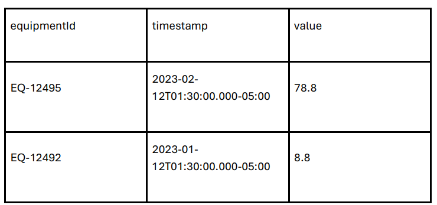

# Getting Started Radix Challenge (ENGLISH)

## Backend

In order to build the backend project, you must follow the thes steps:

- In your terminal go to the backend folder;
- Run the script `npm i` to install the dependencies;
- Run the script `npm run dev-deps-start` to create and run the database container;
- Run the script `npm run dev-migrations-up` to run the migrations and build the table in the database;
- Run the script `npm run dev` to start the application;
- After all these steps the application will be runing and functional, and you can start testing it.

### `Backend endpoints`

- You should use an API testing plataform like "Postman" to test the endpoints;
- The first endpoint is `http://localhost:3001/equipments`. You should use the "POST" request method and send a JSON body in the following format: 

        {
            "equipmentId": "EQ-12496",
            "timestamp": "2024-12-30T12:30:00.000-05:00",
            "value": 500.1
        }

The response must be `"Log saved on database."`

- The second endpoint is `http://localhost:3001/equipments/uploadError`. You should use the "POST" request method. In the body section, you must select "form-data", create a key named `"file"` and in the value field you have to upload a csv file in the following format:

        

The response must be "Error log saved on database."

## Frontend

In order to build the frontend project, you must follow the these steps:

- In your terminal, go to the backend folder;
- Run the script `"npm i"` to install the dependencies;
- Run the script `"npm start"` run the app in development mode;
- On your browser open http://localhost:3000 to see the page;

# Introdução ao Desafio Radix (Português)

## Backend

Para construir o projeto de backend, siga os seguintes passos:

- No terminal, acesse a pasta do backend;
- Execute o comando `npm i` para instalar as dependências;
- Execute o comando `npm run dev-deps-start` para criar e executar o container do banco de dados;
- Execute o comando `npm run dev-migrations-up` para rodar as migrações e criar as tabelas no banco de dados;
- Execute o comando `npm run dev` para iniciar a aplicação;
- Após todos esses passos, a aplicação estará rodando e funcional, e você poderá começar a testá-la;

### `Endpoints do backend`

- Você deve usar uma plataforma de teste de API, como o Postman, para testar os endpoints.
- O primeiro endpoint é `http://localhost:3001/equipments`. Você deve usar o método "POST" e enviar um corpo em formato JSON, conforme o exemplo abaixo:

        {
            "equipmentId": "EQ-12496",
            "timestamp": "2024-12-30T12:30:00.000-05:00",
            "value": 500.1
        }

A resposta deverá ser `"Log saved on database."`

- O segundo endpoint é `http://localhost:3001/equipments/uploadError`. Você deve usar o método "POST". Na seção body, selecione "form-data", crie uma key chamada `"file"` e faça o upload de um arquivo CSV no seguinte formato:

        

A resposta será "Error log saved on database."

## Frontend

Para construir o projeto de frontend, siga os seguintes passos:

- No terminal, acesse a pasta do frontend;
- Execute o comando `npm i` para instalar as dependências;
- Execute o comando `npm start` para rodar o aplicativo no modo de desenvolvimento;
- No seu navegador, acesse http://localhost:3000 para visualizar a página;